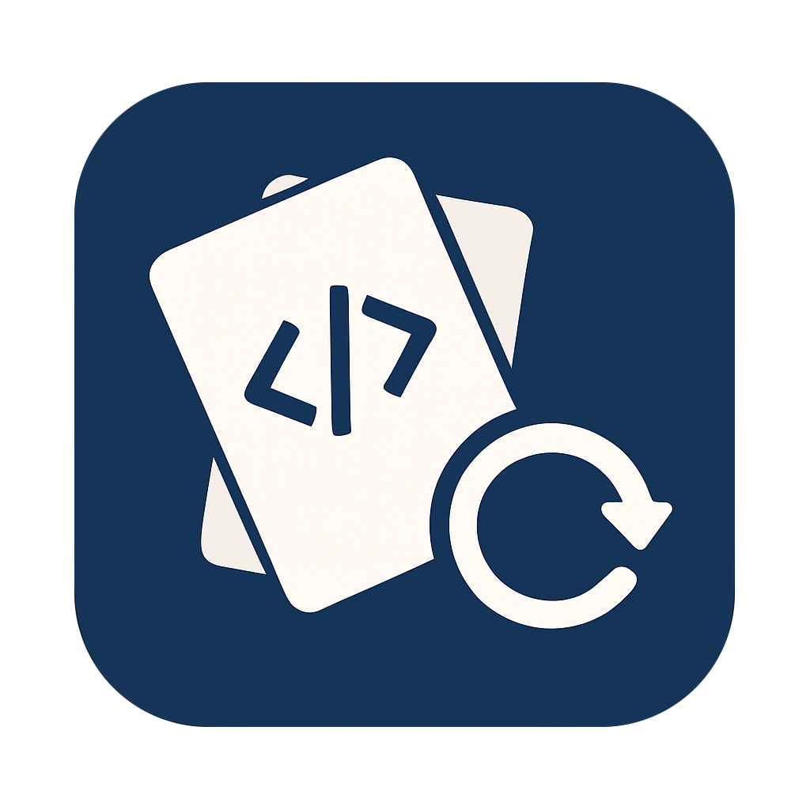

# DotDeck

[](https://github.com/rivethorn/DotDeck/actions/workflows/go.yml)

<p align="center">
    
</p>

---

DotDeck is a **dotfile manager**: it keeps your personal configuration files (shell configs, editor settings, Git configs, etc.) version‑controlled in one place, and then **symlinks** them into the right spots on your system. That way:
- You can edit configs in one central repo
- Changes propagate instantly to your live environment
- You can sync updates across multiple machines using Git

---
## Getting Started

### Prerequisites
- Go 1.18 or later
- Make (for build automation)

### Installation

Clone the repository:
```sh
git clone https://github.com/rivethorn/DotDeck.git
cd DotDeck
```

Build the project:
```sh
make build
```

Or install to your GOPATH:
```sh
make install
```

### Usage

Create a `config.toml` file in the directory where you want to keep your dotfiles.
(e.g. ~/dotdeck)
Example:
```toml
[files]
# Symlink directories
"nvim/"           = "~/.config/nvim/"
# Symlink files
"tmux/.tmux.conf" = "~/.tmux.conf"
```

#### Main Commands

| Command       | What it does                                                                                                        |
|---------------|--------------------------------------------------------------------------------------------------------------------|
| `deck link`   | Reads `config.toml`, backs up any existing files, and creates symlinks from your repo copies to their destinations. |
| `deck unlink` | Removes those symlinks and restores your previous backups.                                                 |
| `deck sync`   | Pulls in changes from your live environment back into the repo, commits them, merges/pulls from remote, and pushes if there’s something new. |
| `--dry-run`   | Available on link/unlink/sync — shows exactly what *would* happen without making changes.                          |
| `--verbose`   | Gives you a play‑by‑play log of every decision and action.                                                          |

---

## 📦 How It Works Internally
1. **Config mapping**  
   You keep a `config.toml` with lines like:
   ```toml
   [files]
   "bash/.bashrc" = "~/.bashrc"
   "git/.gitconfig" = "~/.gitconfig"
   ```
   This is the “source → destination” map for all files.

2. **Safe linking**  
   - Before making a link, DotDeck checks if the target exists.  
   - If it does, it moves it to a `.deckbak` backup file.  
   - Then it creates the symlink.

3. **Unlink + restore**  
   - Detects whether the target is a symlink created by DotDeck.  
   - Removes it, then restores your `.deckbak` if available.

4. **Syncing**  
   - Compares live files with dotfiles directory copies.  
   - If they differ *and* Git marks them dirty (unless `--force`), it copies live changes into the dotfiles directory.  
   - Stages, commits, pulls the latest from remote, resolves via fast‑forward merge, and pushes if ahead.  
   - Uses interactive `git fetch/pull/push` so SSH passphrases can be entered right in your terminal.

---

## Project Structure

- `cmd/` – CLI command implementations
- `internal/` – Internal utilities, config loader, and interactive runner
- `assets/` – Project assets (e.g., images)

## Contributing

Contributions are welcome! Please open issues or submit pull requests for improvements and bug fixes.

## License

This project is licensed under the [MIT License](LICENSE).

---

*Made with Go and ❤️ by rivethorn*


